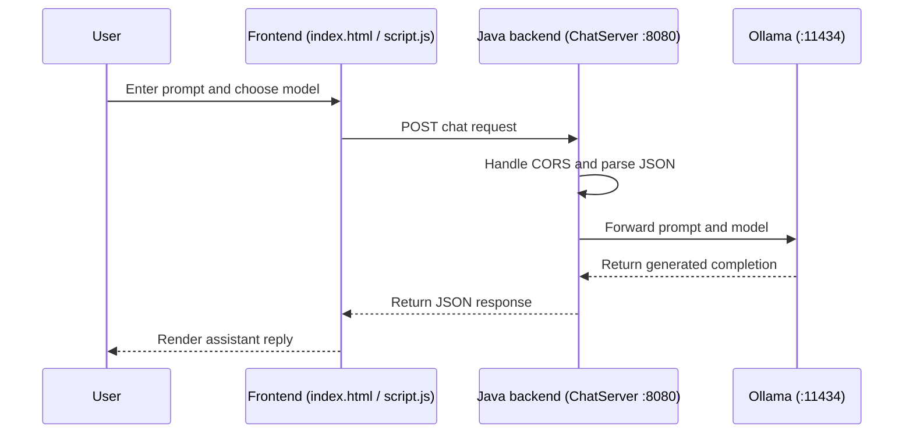

# Local Chatbot Starter Kit

A simple chat web app that talks to an AI model running entirely on your own computer — powered by [Ollama](https://ollama.com), with a Java backend and a plain HTML/CSS/JavaScript frontend.

No API keys, no internet required after setup, no cost. This project is a starter kit for learning how a chat interface, a backend server, and a local AI model all talk to each other — built for [Hacktoberfest](https://hacktoberfest.com/) contributors of any experience level.

## What it does

You type a message → the frontend sends it to the backend → the backend forwards it to a local AI model via Ollama → the model's reply gets sent back and shown on screen.

```
User types message
  → Frontend (HTML/CSS/JS) sends it to the Java backend
    → Backend forwards it to Ollama's local API
      → Ollama generates a reply
    ← Backend extracts the answer, sends it back
← Frontend displays the reply
```

## Architecture



The browser frontend captures the prompt and selected model, then sends that JSON request to `ChatServer` on port `8080`. `ChatServer` acts as the local middleware layer: it handles CORS, parses the request, and forwards only the required prompt/model data to Ollama's local API on `localhost:11434`. Ollama loads the requested model (defaulting to `llama3.2:1b`), generates the completion, and the Java server relays the response back to the browser.

Because the model call stays on `localhost`, no external AI API or cloud key is required for this request flow.

## Tech stack

- **Backend:** Plain Java (`HttpServer` + `HttpClient`, no framework), Jackson for JSON handling
- **Frontend:** HTML, CSS, vanilla JavaScript
- **AI:** [Ollama](https://ollama.com) running the `llama3.2:1b` open-weight model locally

## Quick start

1. **Install Ollama:** [ollama.com](https://ollama.com)
2. **Pull the model:**
   ```
   ollama pull llama3.2:1b
   ```
3. **Run the backend:**
   ```
   cd backend
   javac -cp "lib/*" ChatServer.java
   java -cp ".:lib/*" ChatServer
   ```
4. **Run the frontend:** Open `frontend/index.html` using a local server (e.g. VS Code's "Live Server" extension).
5. **Chat!** Type a message and get a real, locally-generated AI reply.

For a full step-by-step walkthrough (including concepts, glossary, and troubleshooting), see **[RESOURCES.md](./RESOURCES.md)**.

## Contributing

Looking to contribute for Hacktoberfest? Check the **[Issues](../../issues)** tab for open tasks across all difficulty levels and types (Feature, Bug, Frontend, Docs, Testing, and more).

See **[CONTRIBUTING.md](./CONTRIBUTING.md)** for how to fork, branch, and submit a pull request.
